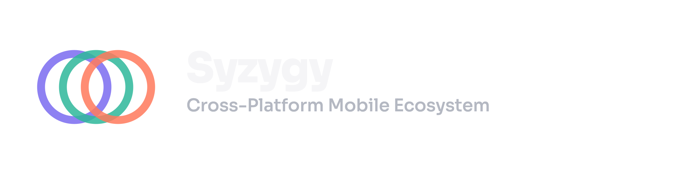

# Syzygy Brand Assets

Official brand assets for the Syzygy ecosystem — logo, icon, banners, color palette, and typography used across all Syzygy libraries and apps.

<p align="center">
  
</p>

## What is Syzygy

Syzygy is a cross-platform mobile ecosystem.

The name comes from the astronomical term for when celestial bodies align (as in an eclipse) — representing multiple platforms coming together into one cohesive, aligned ecosystem.

## Assets

| Asset | File | Use case |
|---|---|---|
| Icon (square) | `syzygy-icon-512.png` | GitHub org avatar, favicon, app icons |
| Icon (SVG) | `syzygy-icon.svg` | Scalable embeds, README headers |
| Icon (WebP) | `syzygy-icon-512.webp`, `syzygy-icon-1024.webp` | Performance-optimized embeds |
| Banner (dark) | `syzygy-banner-dark-2400.png` | README header on dark backgrounds |
| Banner (light) | `syzygy-banner-light-2400.png` | README header on light backgrounds |
| Banner (SVG) | `syzygy-banner-dark.svg`, `syzygy-banner-light.svg` | Scalable embeds |
| Banner (WebP) | `syzygy-banner-*.webp` | Portfolio site, performance-optimized embeds |

## Usage in README files

Use the `<picture>` tag so the banner automatically switches with the viewer's GitHub theme:

```html
<picture>
  <source media="(prefers-color-scheme: dark)" srcset="https://raw.githubusercontent.com/Syzygy-Hub/syzygy-brand-assets/main/Assets/syzygy-banner-dark-2400.png">
  
</picture>
```

## Color palette

| Color | Hex |
|---|---|
| Purple | `#7F77DD` |
| Teal | `#1D9E75` |
| Coral | `#D85A30` |

## Typography

**Wordmark & headings:** [Sora](https://fonts.google.com/specimen/Sora) — bold, geometric, technical feel.

## Brand guide

See [`BRAND_GUIDE.md`](BRAND_GUIDE.md) for full usage guidelines, spacing rules, and dos/don'ts.

## License

MIT — free to use across all Syzygy-Hub repos. Not intended for use outside the Syzygy ecosystem without permission.
